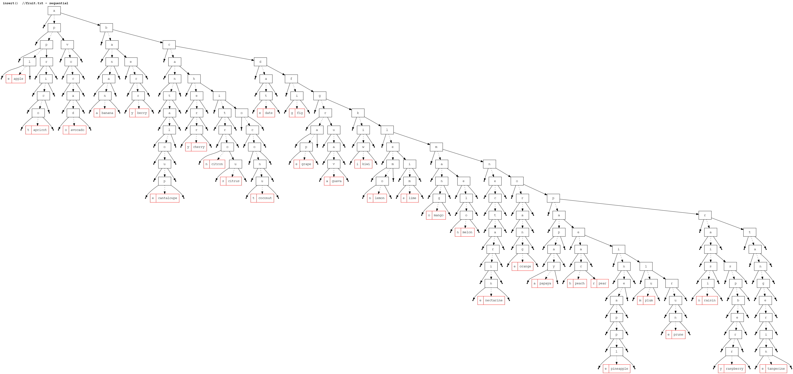

hxTSTree
========

A Ternary Search Tree in Haxe 3.1+. [**WIP**]

[online swf demo](https://dl.dropboxusercontent.com/u/32864004/dev/FPDemo/hxTSTreeDemo.swf)

Based on Dr. Dobbs article ([http://www.drdobbs.com/database/ternary-search-trees/184410528](http://www.drdobbs.com/database/ternary-search-trees/184410528)).

-----
###Internal repr. (inserting `fruit.txt`)

 - **TSTree.insert() - sequential**

	
 - **TSTree.randomBulkInsert() - random**

	
 - **TSTree.bulkInsert() - balanced**

