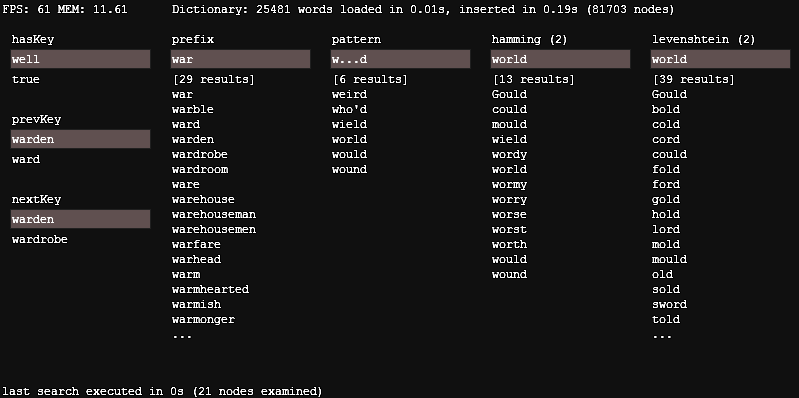

hxTSTree
========

A [Ternary Search Tree](http://en.wikipedia.org/wiki/Ternary_search_tree) in Haxe 3.1+.

[online swf demo](https://dl.dropboxusercontent.com/u/32864004/dev/FPDemo/hxTSTreeDemo.swf)

Based on Dr. Dobbs article ([http://www.drdobbs.com/database/ternary-search-trees/184410528](http://www.drdobbs.com/database/ternary-search-trees/184410528)).

**Features:**

 - Multiple search types (exact, prefix, pattern, [Hamming distance](http://en.wikipedia.org/wiki/Hamming_distance), [Levenshtein distance](http://en.wikipedia.org/wiki/Levenshtein_distance))
 - Multiple insert modes (sequential, random, balanced)
 - Serialization/Unserialization
 - Association of arbitrary data to keys (~like a `Map<String, T>`)
 - Returned keys (/data) are given in sorted order
 - DOT format file writer (for visualization with tools like [Graphviz](http://www.graphviz.org/)) 

## Internal representation (with [`fruit.txt`](assets/fruit.txt) word list)

**TSTree.bulkInsert() - sequential**

**TSTree.randomBulkInsert() - random**

**TSTree.balancedBulkInsert() - balanced**

## References

 - [http://www.drdobbs.com/database/ternary-search-trees/184410528](http://www.drdobbs.com/database/ternary-search-trees/184410528)
 - [http://en.wikipedia.org/wiki/Hamming_distance](http://en.wikipedia.org/wiki/Hamming_distance)
 - [http://en.wikipedia.org/wiki/Levenshtein_distance](http://en.wikipedia.org/wiki/Levenshtein_distance)
 - [http://stevehanov.ca/blog/index.php?id=114](http://stevehanov.ca/blog/index.php?id=114)
 - [http://www.let.rug.nl/kleiweg/lev/](http://www.let.rug.nl/kleiweg/lev/)

## License

**hxTSTree** is developed by Giuseppe Di Mauro (azrafe7) and released under the MIT license. See the [LICENSE](LICENSE) file for details. 
